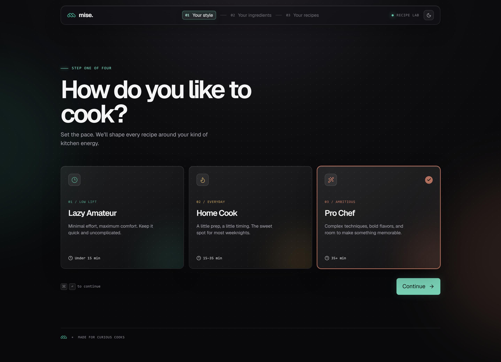
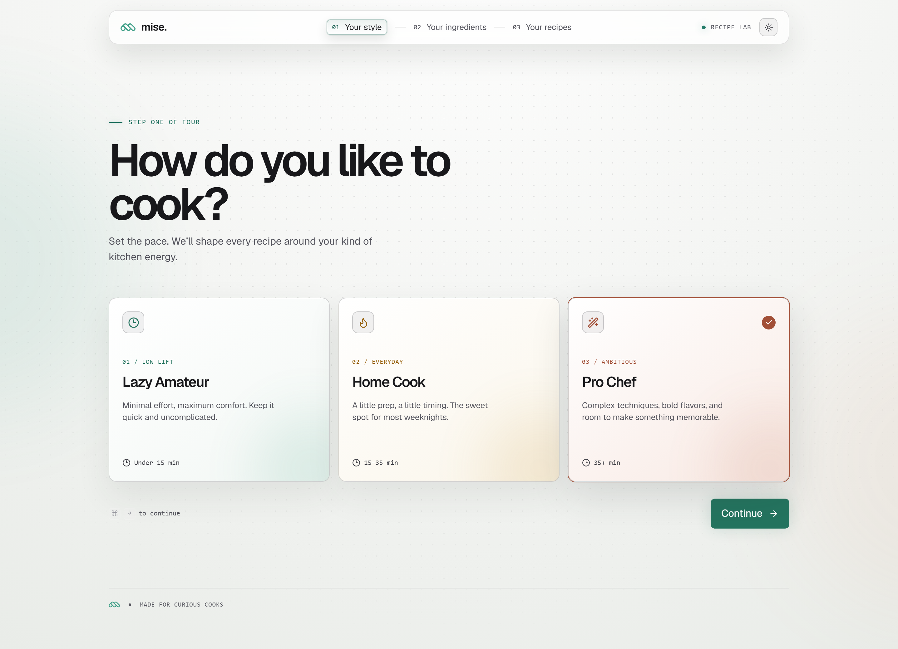
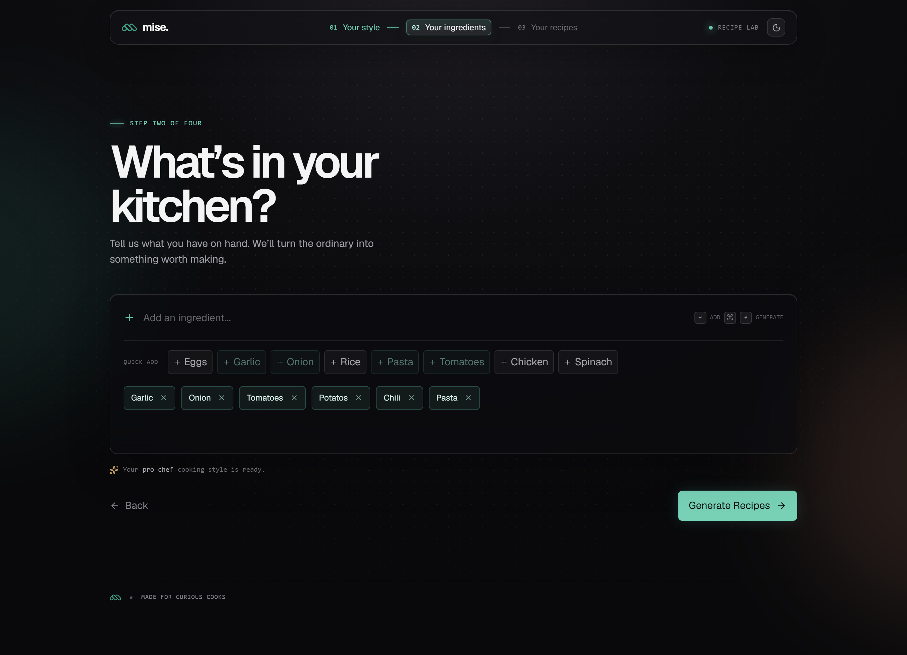
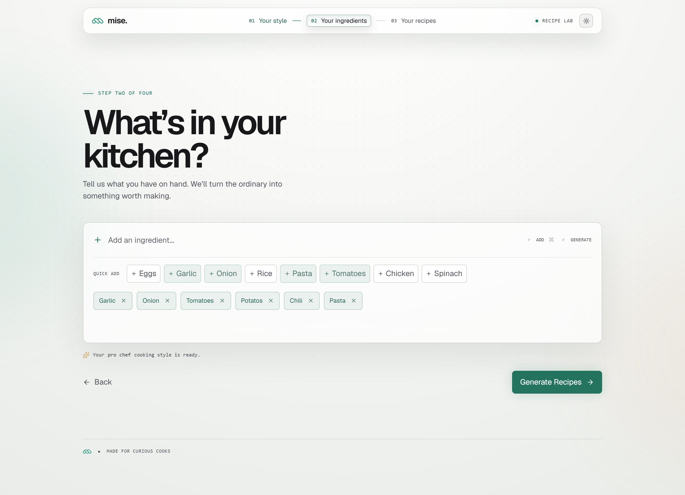
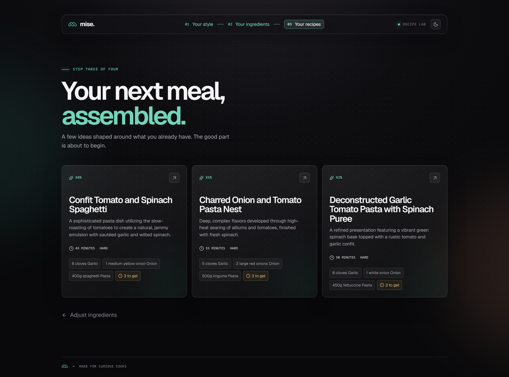
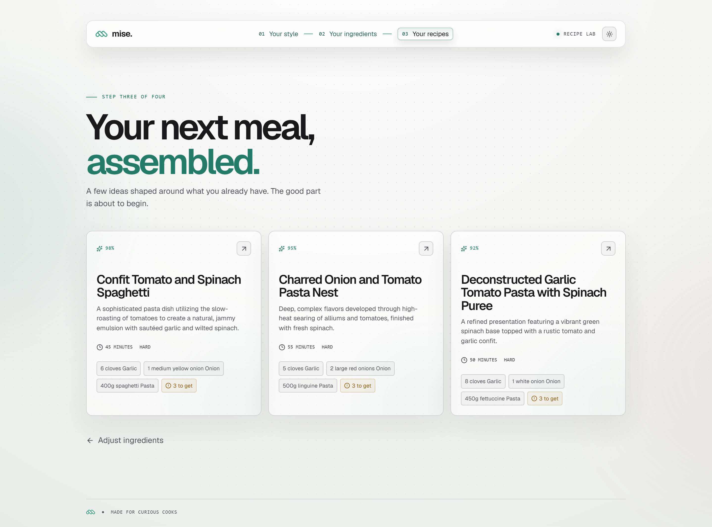
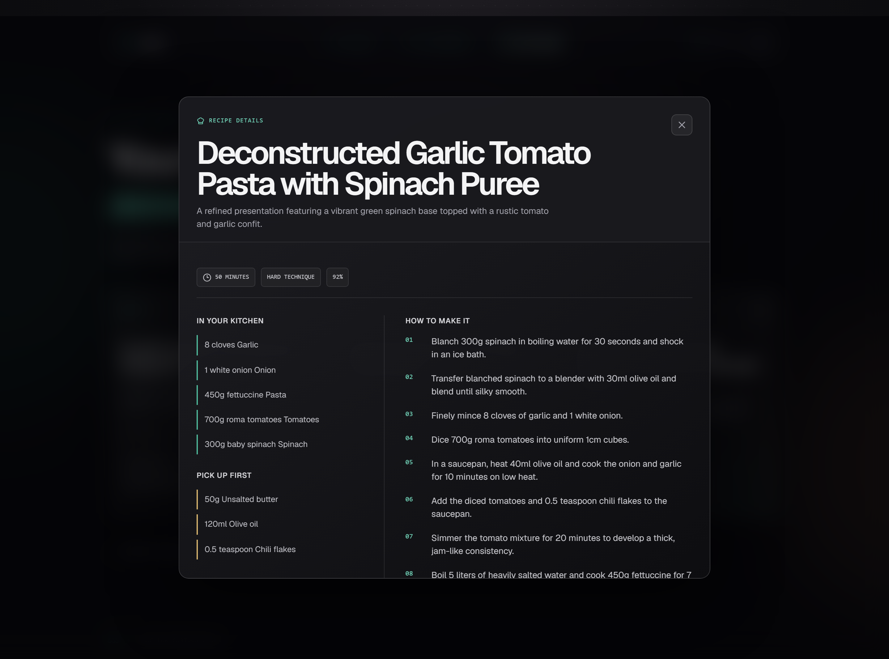
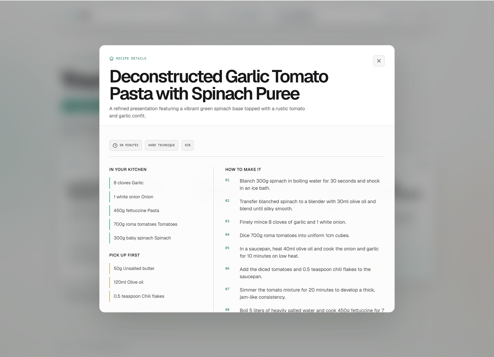

# mise. - AI Recipe Generation

A modern AI-powered kitchen assistant that turns available ingredients into personalized recipes, smart cooking guidance, and meal inspiration for any skill level.

## Overview

`mise.` is an AI-powered recipe generator built to turn everyday ingredients into practical, personalized meal ideas. It helps users reduce food waste, simplify meal planning, and discover recipes that match their cooking skill level and available pantry items.

The platform is designed for home cooks, busy households, and anyone who wants quick inspiration without needing to start from scratch. By combining ingredient input with recipe generation, `mise.` delivers relevant suggestions, pantry gap analysis, and clear cooking instructions in a single, guided experience.

## Features

| Feature | Description |
| --- | --- |
| Skill-based recipe generation | Users can choose among different cooking levels such as lazy amateur, home cook, and pro chef. |
| Ingredient-driven suggestions | Recipes are generated from selected ingredients to maximize ingredient usage and practicality. |
| Three recipe results | The app returns multiple recipe options ranked by ingredient fit and usability. |
| Structured recipe output | Each recipe includes ingredients, missing pantry items, and step-by-step cooking instructions. |
| Responsive UI | The interface is built for desktop and mobile-friendly browsing using a polished component system. |
| Streaming AI responses | Recipe results are generated and streamed progressively for a smoother experience. |
| Modern design system | Tailwind CSS and shadcn-inspired UI components provide a clean, consistent experience. |

## Tech Stack

| Category | Technology |
| --- | --- |
| Frontend | React, TypeScript, Vite |
| Styling | Tailwind CSS, custom UI components |
| AI Engine | Google Gemini via `@ai-sdk/google` and `ai` SDK |
| State / Flow | React hooks and app step flow |
| Build tooling | Vite, TypeScript, ESLint |
| Component library | shadcn-style component primitives |
| Icons / visuals | Lucide React, motion utilities |

## Get Started

### Prerequisites

Before running the project, make sure you have the following installed:

- Node.js 18+
- npm or yarn
- A Google AI Studio / Gemini API key

### Install dependencies

```bash
npm install
```

### Configure environment

Create a `.env` file in the project root and add your Gemini API configuration:

```env
GOOGLE_GENERATIVE_AI_API_KEY=
GEMINI_MODEL=
```

Then start the development server:

```bash
npm run dev
```

Open the local URL shown in the terminal to use the app.

## How it Works

The app follows a simple guided flow:

1. The user selects a cooking skill level.
2. They add the ingredients they want to cook with.
3. The app sends the request to the Gemini-powered backend generator.
4. The backend creates three recipe ideas with ingredient quantities, pantry gaps, and step-by-step instructions.
5. The results are displayed in the UI for review and selection.

The generation logic is implemented in the server route found in `server/generate-recipes.ts`, which validates inputs, calls the Google model, and streams structured responses back to the frontend.

## Project Structure

```text
ai-recipe-generator/
├── public/
├── server/
│   └── generate-recipes.ts
├── src/
│   ├── App.css
│   ├── App.tsx
│   ├── components/
│   │   ├── layout/
│   │   ├── navigation/
│   │   ├── recipe/
│   │   ├── theme/
│   │   └── ui/
│   ├── data/
│   ├── hooks/
│   ├── lib/
│   ├── pages/
│   ├── index.css
│   └── main.tsx
├── .env
├── components.json
├── eslint.config.js
├── index.html
├── package.json
├── README.md
├── tailwind.config.js
├── tsconfig.app.json
├── tsconfig.json
├── tsconfig.node.json
├── vite.config.ts
└── public/
```

## Screenshots

### Skill Selection

| Dark mode | Light mode |
| --- | --- |
|  |  |

### Ingredient Input Flow

| Dark mode | Light mode |
| --- | --- |
|  |  |

### Generated Recipes

| Dark mode | Light mode |
| --- | --- |
|  |  |

### Recipe Details

| Dark mode | Light mode |
| --- | --- |
|  |  |
